# <center> 中山大学计算机学院人工智能本科生深度强化学习实验报告
> <center>（2022学年春季学期）
------
<font size=2>课程名称：Artificial Intelligence</font>

<div class="center">
## 一.实验题目
以Cart Pole为环境，实现DQN和PG算法，要求对结果数据进行可视化。

- #### Cart Pole环境：

  调用python库gym： 一个研究和开发强化学习相关算法的仿真平台。选择其中的环境“CartPole-v0”

  该环境为电杆车游戏，电杆由一个未驱动的关节连接到一辆大车上，大车沿着无摩擦的轨道移动。摇锤垂直放置在手推车上，目标是通过在手推车上施加左右方向的力来平衡杆。

  由于目标是尽可能长时间保持杆直立，因此每迈出一步（包括终止步骤）都会获得+1的奖励。奖励阈值为200 。

  **一下任何一种情况的发生将导致一次游戏停止：**
  1.电杆的极角大于±12°
  2.大车位置大于±2.4（大车中心到达显示屏边缘）
  3.奖励达到阈值(200)。

  


## 二.实验内容

### 1.算法原理：

- ### 马尔科夫决策问题MDF:

  马尔科夫决策问题的目标是找到一个策略 ，使其回报函数的长期累积值的数学期望最大。其中计算价值的策略选择Π以及下一时刻状态 St+1 仅依赖于当前状态 St 和动作 At，而不依赖于过去的状态和动作。

  

- ### Q学习:

  Q学习（Q-learning）算法是一种与模型无关的强化学习算法，以马尔科夫决策过程为理论基础。在马尔科夫链体系下，两个相邻状态状态差一个奖励r经常能被利用。**所以最佳Q值的更新涉及到状态相邻Q值的损失，所以要引进γ作为损失值。**
  $$
  Q∗(s,a)=Q(s,a)+α(r+γmaxa′Q(s′,a′)−Q(s,a))
  $$
  即Q\*(s,a)位置元素的值等于回报函数Q的相应值加上折扣因子γ乘以转换到下一个状态后最大的Q\*值。

  Q学习通过对环境的不断探索，积累历史经验，agent通过不断试错来强化自身，最终可以达到自主选择最优动作的目标，即不论出于何种状态，都可给出到达目标状态的最优选择路径，该算法中环境和动作相互影响，动作的选择影响环境状态，环境也可以通过强化回报函数 来反馈动作的优劣性，影响动作的选择。


- ### 深度 Q 网络DQN：

  - **Q学习与神经网络**：在普通的Q-learning中，当状态和动作空间是离散且维数不高时可使用Q-Table储存每个状态动作对的Q值，但当状态和动作空间是高维连续时，使用Q-Table不现实。深度神经网络可以自动提取复杂特征，因此，这时候使用**神经网络**对于对应**输入的状态**从而算出对应的**动作以及q值，**更加合理。解决连续型问题，如果表格不能表示，就用函数，而最好的函数就是深度神经网络
  - **经验池(experience replay)**:将每一次状态以及其对应的奖励、下一个状态、动作等作为4元组或五元组存入经验池，**每当经验池满时，随机取其中数个成员作为batch加入神经网络进行学习。**

  - **同策略 (On-policy) 与异策略 (Off-policy)**:

    在强化学习中，我们让智能体与环境交互，记录下观测到的状态、动作、奖励，用 这些经验来学习一个策略函数。在这一过程中，控制智能体与环境交互的策略被称作**行为策略**。行为策略的作用收集观测的状态、动作、奖励。

    **强化学习的目的是得到一个策略函数，**用这个策略函数来控制智能体。这个策略函 数就叫做**目标策略**。

    - 同策略：

      同策略是指用相同的行为策略和目标策略

    - 异策略：

      异策略是指用不同的行为策略和目标策略，一般使用都为异策略，**所以本次实验也将使用异策略。**

      使用另一个网络作为目标策略(Target_net)网络，产生Target Q‘值。表示当前行为策略网络的的输出，用来评估当前状态动作对的值函数； Q’表示Target_net的输出，代入上面求 TargetQ值的公式中得到目标Q值。之后根据**神经网络中的损失函数**更新行为策略网络的参数，每经过N轮迭代，将行为策略的参数复制给目标策略。

      使用异策略后，再一段时间里目标Q值使保持不变的，一定程度降低了当前Q值和目标Q值的相关性，提高了算法稳定性。


- ### 策略梯度PG：

  相对于DQN使用经验池，在经验池满时才进行网络的更新。Policy Gradient是在**每次游戏结束的时候进行学习，更新网络。**

  - **目标函数**：PG的状态价值既依赖于当前状态 st，也依赖于策略网络 π 的参数 θ，其中θ为采取神经网络的参数。因为PG是直接更新策略，所以可以略过状态st的影响，只于神经网络参数θ。所以PG学习可以描述为这样一个优化问题：
    $$
    maxJ(θ)
    $$
    因此可以用梯度上升更新 θ，使得 J(θ) 增大。设当前策略网络的参数为 θnow，做梯度上升更新参数，得到新的参数θnew，有以下公式
    $$
    θnew ← θnow + β · ∇θJ(θnow)
    $$
    其中β是学习率， ∇θJ(θnow)为梯度，这也是策略梯度的关键。


### 2.相关思路以及流程图：
- ### **相关思路** ：

    #### Cart Pole环境处理：

    使用相关库的调用即可。

    #### DQN实现:

    1.设置调用pytorch库建立两个**Q学习神经网络**q_eval和q_target作为**行为策略和目标策略。**其中的推进函数、误差分析和反向传递均使用库实现，**激活函数使用RELU函数。**
    
    2.设置动作选择函数，用于决定为了进入下一个状态的**动作**。使用**贪心策略，设置超参数epsilon，随机取值大于epsilon则随机选取动作，否则选择观测价值最大的动作。**
    
    3.设置经验池以及相关管理函数。
    
    4.设置强化学习函数，对行为策略进行学习，并在一定间隔后更新**目标策略**。先从经验池中随机选取一定数量的状态，使用行为策略算出当前价值Q，使用目标策略算出下一个阶段价值Q，根据Q学习的公式
    $$
    Q∗(s,a)=Q(s,a)+α(r+γmaxa′Q(s′,a′)−Q(s,a))
    $$
    得到**目标Q值**，之后使用目标Q值和当前价值Q得出损失值，并由库中损失函数算出用于**反向传递**的梯度。由此更新行为策略的神经网络。
    
    5.处理环境，通过调用库处理好环境与DQN算法的接口，最后调用即可。
    
    
    
    #### PG实现:
    
    1.设置调用pytorch库建立一个**神经网络**即可。其中的推进函数、误差分析和反向传递均使用库实现，**输入层到隐藏层激活函数使用RELU函数，而隐藏层到输出层使用将指数归一化的softmax函数**
    
    2.设置动作选择函数，直接采用**pytorch中的Categorical模块**，因为动作选择输入的状态将形成一维数组，所以**Categorical每个元素是对该索引处的类进行抽样的相对概率，直接按照指数函数概率选择动作，因为指数函数是单调递增的，所以选择的动作将会是越来越优。**
    
    3.设置经验池以及相关管理函数。**这时候的经验池是存放每次游戏的游戏步骤。**
    
    4.设置强化学习函数，根据当前状态的奖励值，根据
    $$
    θnew ← θnow + β · ∇θJ(θnow)
    $$
    得到**新的状态的估计所有奖励值**，之后根据新的估计奖励值于旧的奖励值，经过log_probs判断出出现密度最大，也就是概率最高的奖励值，与旧的奖励值更新出损失值，之后通过torch反向传递。
    
    5.处理环境，通过调用库处理好环境与PG算法的接口，最后调用即可。
    
    
    
    #### DQN流程图：
    
    - #### DQN：
    
      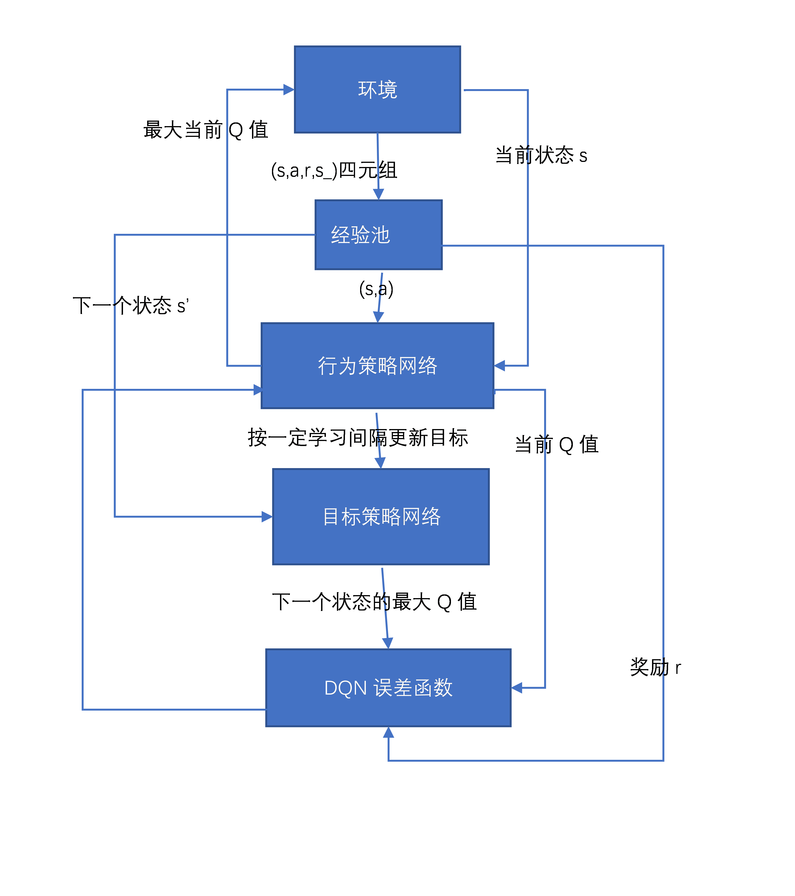
    
      其中损失函数调用pytorch库，如下：
      $$
      L=(r+γmaxQ(a’)-Q(a_))²
      $$
    
      #### 损失函数流程图
    
      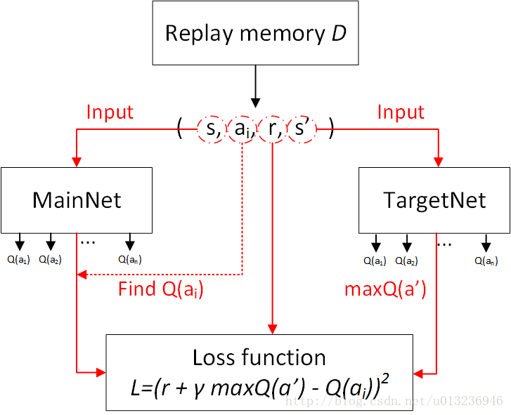
    
    - #### PG：
    
      事实上PG的流程图将与上述DQN大致相同，仅是只有一个神经网络用于学习，经验池也从固定大小变为每次实验的移动步数。便不再赘述。
    
    #### PG伪代码：
    
    

### 3.关键代码展示：

#### DQN:

##### 一、超参数以及图形化预设：

```python
# Hyper Parameters
BATCH_SIZE = 128		#batch大小
LR = 0.001                   # 学习率learning rate
EPSILON = 1               # 贪心策略greedy policy
EPSILON_de = 0.999			#epsilon会逐渐减小
EPSILON_min = 0.05			#epsilon有一个最小值
GAMMA = 0.99                 # 折扣率
TARGET_REPLACE_ITER = 100   # 每学习100次更新一次目标策略
MEMORY_CAPACITY = 10000		#经验池大小
episode_size = 2000			#测试集次数
env = gym.make('CartPole-v0')	#引入环境
# env = env.unwrapped
x_label = []   #episode
y_label = []    #reward
z_label = []    #损失loss
v1_label = []   #reward方差
v2_label = []   #loss方差
N_ACTIONS = env.action_space.n		#环境输入动作
N_STATES = env.observation_space.shape[0]	#环境状态转为数组
ENV_A_SHAPE = 0 if isinstance(env.action_space.sample(), int) else env.action_space.sample().shape     #环境与dqn输入矩阵大小限定
```

##### 二、神经网络设置

```python
class Net(nn.Module):
    def __init__(self, ):
        super(Net, self).__init__()
        self.fc1 = nn.Linear(N_STATES, 64)	#输入层
        self.out = nn.Linear(64, N_ACTIONS)#输出层
    def forward(self, x):
        x = self.fc1(x)#隐藏层激活
        x = F.relu(x)#relu作为激活函数
        actions_value = self.out(x)
        return actions_value
```

- 因主要依靠pytorch库函数实现，便不再赘述。

##### 三、DQN预设以及环境的动作选择：

- DQN预设

  ```python
  class DQN(object):
      def __init__(self):
          self.eval_net, self.target_net = Net(), Net()
          self.learn_step_counter = 0                                     # for target updating
          self.memory_counter = 0                                         # for storing memory
          self.memory = []
          self.optimizer = torch.optim.Adam(self.eval_net.parameters(), lr=LR)
          self.loss_func = nn.MSELoss()
  ```

  - 为DQN预设**目标策略和行为策略两个神经网络**
  - learn_step_counter用于更新目标策略
  - memory_counter用于**计算经验池是否存满**
  - memory为经验池
  - loss_func为库中自带损失函数

- 动作选择

  ```python
  #动作选择
      def choose_action(self, x):
          x = torch.Tensor(x)
          if np.random.uniform() < EPSILON:   # 贪心选择动作greedy
              t = np.random.randint(0, env.action_space.n)
              action = t
          else:   # random
              action_value = self.eval_net(x)
              action = torch.max(action_value, dim=-1)[1].numpy()
          return int(action)
  ```

  - 若随机的概率小于epsilon，则针对环境**随机采取动作**
  - 若大于，则将环境可选择动作**都经过学习后，采取价值最大的动作**

- 经验池存入

  ```python
  #存入经验池
  def store_transition(self, *transition):
      if len(self.memory) == MEMORY_CAPACITY :
          self.memory.pop(0)
          self.memory.append(transition)
          self.memory_counter += 1
  ```

  - 将输入的4元组作为指针简单存入列表

##### 四、DQN学习：

```python
def learn(self):
        # 更新目标策略网络
        if self.learn_step_counter % TARGET_REPLACE_ITER == 0:
            self.target_net.load_state_dict(self.eval_net.state_dict())
        self.learn_step_counter += 1

        # 从经验池中随机选取若干状态作为batch
        sample_index = np.random.choice(len(self.memory), BATCH_SIZE)
        # 将选出来的状态的各个参数进行格式化，以便于输入神经网络
        batch = [self.memory[i] for i in sample_index]
        b_s,b_a,b_r,b_s_ ,dones = zip(*batch)
        b_a = torch.LongTensor(b_a)
        dones = torch.FloatTensor(dones)
        b_r = torch.FloatTensor(b_r)
        b_s = torch.FloatTensor(b_s)
        b_s_ = torch.FloatTensor(b_s_)

        #将每个选出状态输入行为策略网络计算
        q_eval = self.eval_net(b_s).gather(-1, b_a.unsqueeze(-1)).squeeze(-1)  # shape (batch, 1)
        #将每个选出状态输入目标策略网络计算
        q_next = self.target_net(b_s_).detach()     # detach from graph, don't backpropagate
        #根据公式算出目标Q值以近似最佳状态
        q_target = b_r + GAMMA * (1 - dones) * torch.max(q_next, dim=-1)[0] 
        #计算损失值
        loss = self.loss_func(q_eval, q_target)
        #可视化相关
        z_label.append(int(loss))
        v2_label.append(np.var(z_label))
        #行为策略网络反向传递
        self.optimizer.zero_grad()
        loss.backward()
        self.optimizer.step()
```

- 在学习前，需要判断是否更新目标策略神经网络
- 从经验池中选取batch作为学习资源
- 输入行为策略神经网络得到对应策略的**价值q**
- 输入目标策略审计网络得到**下一个状态对应策略的价值q**‘
- 根据公式得出**当前状态近似最佳价值q\***
- 根据q\*和q'得出损失值，并更新行为策略神经网络权重

##### 五、测试用函数：

```python
for i_episode in range(episode_size):	#进行episode
    s = env.reset()	#获取环境初始信息
    ep_r = 0		#奖励值
    while True:	
        # env.render()
        a = dqn.choose_action(s)	#选择动作
        # take action
        s_,r, done, info = env.step(a)#得到下一个状态的信息
        dqn.store_transition(s, a, r, s_,done)#加入经验池
        ep_r += r	#奖励增加
        s = s_		#状态切换
        if dqn.memory_counter >= MEMORY_CAPACITY:#经验池则满学习
            dqn.learn()	#学习
            if done:	#游戏结束
                x_label.append(i_episode)
                y_label.append(ep_r)
                v1_label.append(np.var(y_label))
                print('Ep: ', i_episode,'| Ep_reward: ', ep_r)

        if done:
            break
```

- 首先从环境得到输入数据

- 经过动作选择得到新的信息后加入经验池

- 经验池满则学习


#### PG：

##### 一、超参数以及图形化预设：

```python
# Hyper Parameters
LR = 0.001                   # 学习率learning rate
log_freq = 20			 #载入日志频率
GAMMA = 0.99                 # 折扣率
MEMORY_CAPACITY = 10000		#经验池大小
episode_size = 3000		#测试集次数
env = gym.make('CartPole-v0')	#引入环境
```

##### 二、神经网络设置

```python
class Net(nn.Module):
    def __init__(self, ):
        super(Net, self).__init__()
        self.fc1 = nn.Linear(N_STATES, 32)
        self.out = nn.Linear(32, N_ACTIONS)
    def forward(self, x):
        x = torch.Tensor(x)
        x = F.relu(self.fc1(x))
        prob = F.softmax(self.out(x), dim=-1)
        return prob
```

- **输入层到隐藏层激活使用RELU，隐藏层到输出层用softmax**
- 因主要依靠pytorch库函数实现，便不再赘述。

##### 三、PG预设以及环境的动作选择：

- PG预设

  ```python
  class PG(object):
      def __init__(self):
          self.net = Net()
          self.memory_counter = 0                                         # for storing memory
          self.memory = []
          self.optimizer = torch.optim.Adam(self.net.parameters(), lr=LR)
          self.loss_func = nn.MSELoss()
  ```

  - PG只需要一个神经网络
  - 其余部分与DQN类似，便不再赘述

- 动作选择

  ```python
  #动作选择
      def choose_action(self, x):
          prex = self.net(x)
          dist = Categorical(prex)
          action = dist.sample()
          log_prx = dist.log_prob(action)
          return int(action),log_prx
  ```

  - 使用库Categorical，将状态带入指数函数进行转换。
  - 采取转化后密度最大的动作。

- 经验池存入

  ```python
  #存入经验池
      def store_transition(self, *transition):
          if len(self.memory) == MEMORY_CAPACITY :
              self.memory.pop(0)
          self.memory.append(transition)
          self.memory_counter += 1
  ```

  - 与DQN一致，不过输入变为**动作转换的指数频率与奖励二元组**

##### 四、PG学习：

```python
def learn(self):
        log_probs,rewards = zip(*self.memory)
        log_probs = torch.stack(log_probs)
        T = len(rewards)
        ret = np.empty(T,dtype=np.float32)
        next_ret = 0.0
        for t in reversed(range(T)):
            next_ret = rewards[t] + GAMMA * next_ret
            ret[t] = next_ret
        ret = torch.tensor(ret)
        loss = -ret * log_probs
        #可视化相关
        z_label.append(int(loss.mean()))
        v2_label.append(np.var(z_label))
        #反向传递
        self.optimizer.zero_grad()
        loss.sum().backward()
        self.optimizer.step()
```

- 因为每次游戏就学习，所以**每次经验池的内容都需要全部学习**。
- 将经验池全部状态进行指数转换，得出**本次游戏所有步骤的奖励值以及对应的指数密度**
- 根据公式得出**下一状态所有步骤的奖励值以及对应的指数密度**
- 根据下一状态所有步骤的奖励值和当前状态的指数密度出损失值，并更新行为策略神经网络权重

##### 五、测试用函数：

```python
pg = PG()
for i_episode in range(episode_size):	#进行episode
    s = env.reset()	#获取环境初始信息
    ep_r = 0		#奖励值
    while True:	
        # env.render()
        a ,log_p= pg.choose_action(s)	#选择动作
        # take action
        s_,r, done, info = env.step(a)#得到下一个状态的信息
        pg.store_transition(log_p,r)#加入经验池
        ep_r += r	#奖励增加
        s = s_		#状态切换
        if done:
            pg.learn()
            pg.memory.clear()
            x_label.append(i_episode)
            y_label.append(ep_r)
            v1_label.append(np.var(y_label))
            print('Ep: ', i_episode,'| Ep_reward: ', ep_r)

        if done:
            break
```

- 选择动作多出了计算指数密度，并将指数密度作为成员加入经验池
- 余下与DQN一致，便不再赘述

### 4.代码改动：
- #### DQN中贪心策略的改进

  对于在新的游戏中采取哪一种动作，原先代码限制epsilon为0.9，经测试发现学习效果不尽人意。因此改进贪心策略，使epsilon会在每次游戏中不断减小，这意味着学习成果的利用率将越来越高

  ```python
  EPSILON = 1               # 贪心策略greedy policy
  EPSILON_de = 0.999			#epsilon会逐渐减小
  EPSILON_min = 0.05			#epsilon有一个最小值
  ```

  - 增加epsilon最大值、最小值和损失速率

  ```python
  if dqn.memory_counter >= MEMORY_CAPACITY:
      if EPSILON > EPSILON_min:#减少epsilon
          EPSILON *= EPSILON_de
  ```

  - **在学习前减少**

- #### *注：相关对比测试将会在实验结果展示并分析


## 三.实验结果及分析
#### 实验结果

- #### DQN改版贪心前：

  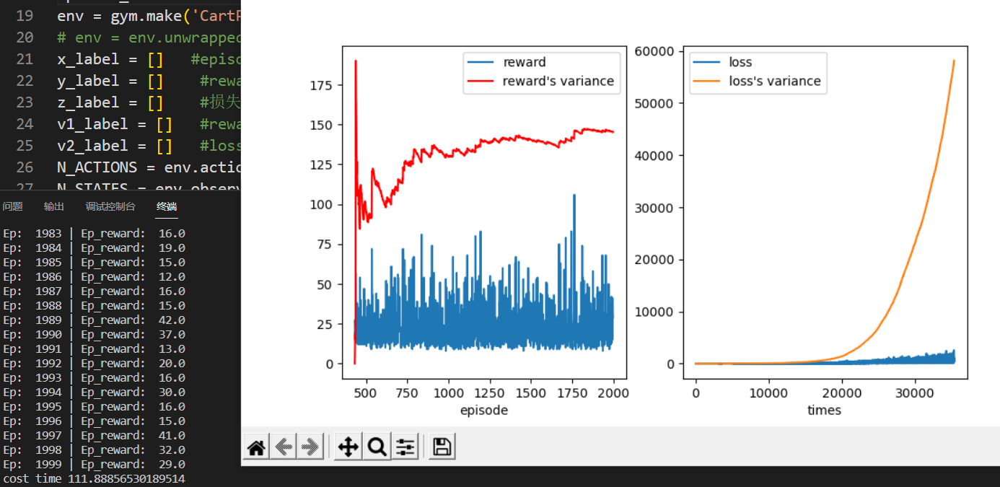

  - 测试2000次，即episode为2000，耗时111.888秒

- #### DQN改版贪心后：

  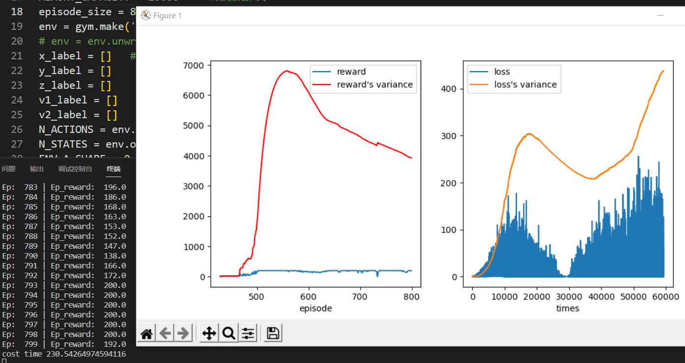

  - 测试800次，耗时230.54秒

- #### PG：

  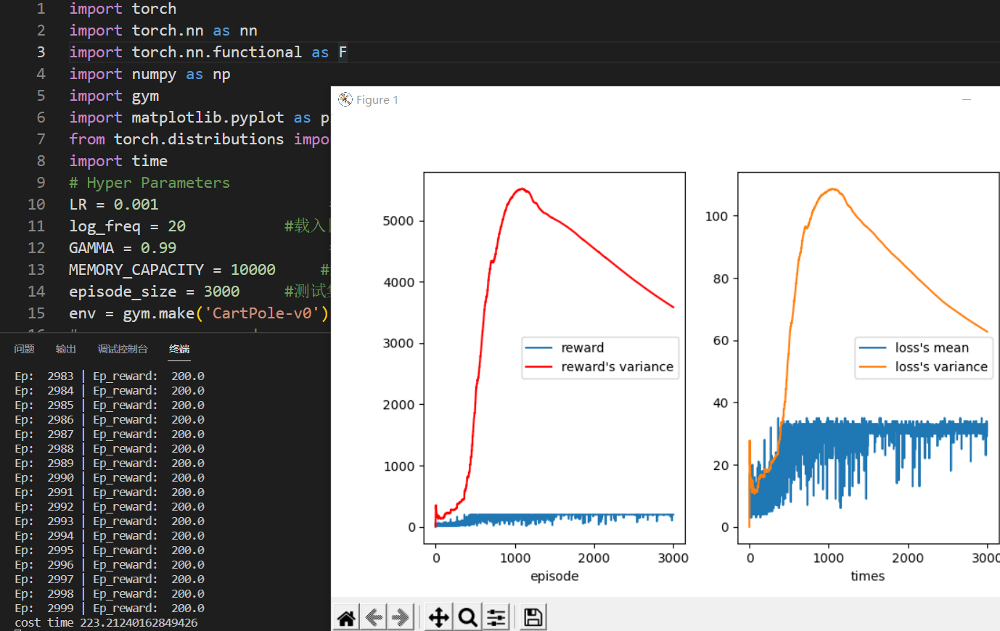

  - 测试3000次，耗时223.212

#### 分析

**\*注：减小episode是为了使图像截图更加明显，欲观看完成截图，请前往result文件夹**

##### 改版前DQN

- #### episode=2000

  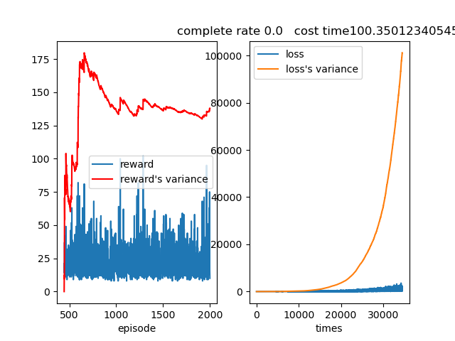

  - 可以看到reward不断起伏，而其方差随着学习次数增加而平缓。但是reward极限只能到100出头，没有成功完成游戏过
  - loss在逐渐增加，方差也在增大，说明神经网络更新幅度大，而reward的值也不稳定

- #### episode=1000

  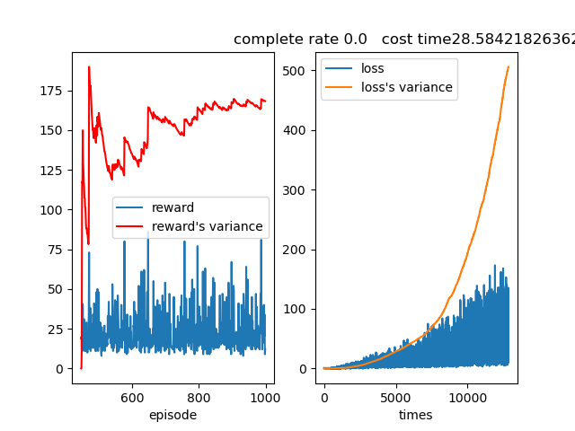

  - 可以看到reward起伏巨大，方差也是
  - loss在逐渐增加，方差也在增大。

- #### episode=700

  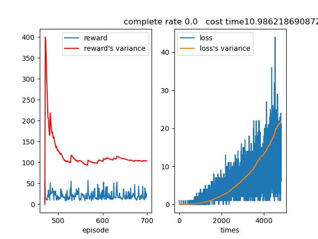

  - 图像基本和以上测试一致。

- #### 归总：改版前DQN的结果虽然都不好，但可以看出在实验一开始时episode较小时，reward方差虽然波动很大，但会快速上升到一个极值，之后伴随着巨大波动逐渐减小，而reward逐渐平稳，虽然波动还是很大。而loss也是逐渐增加，但以为reward未达到最佳，所以loss并未达到极值并开始收敛。

##### 改版后DQN

- #### episode = 2000

  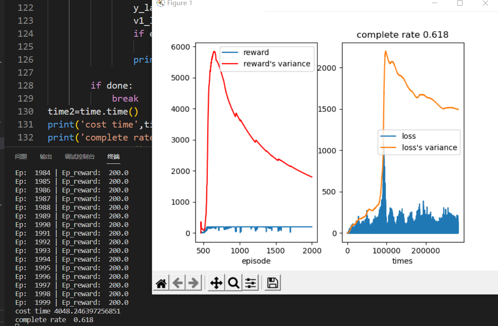

  - 测试2000次，改进后dqn的游戏完成率可达到0.618，但是耗时非常久，要4048.24秒，1小时多的时间。
  - reward在维持200左右会有波动，方差在测试次数650左右达到峰值，并开始减少，这代表reward的波动在逐渐减小
  - 前10000次学习loss波动很大，呈逐步上升趋势。但是在100000次学习左右开始方差减少，loss值下降也逐渐稳定。

- #### episode = 800

  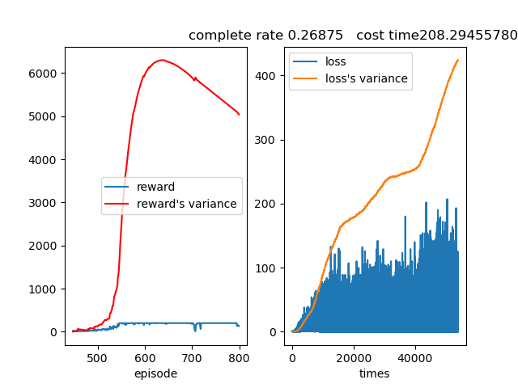

  - 测试800次，可以看到reward在维持200之时会有波动，reward方差在接近650次测试时到达峰值，之后下降
  - loss不断增大，方差不断增加

- #### episode = 600

  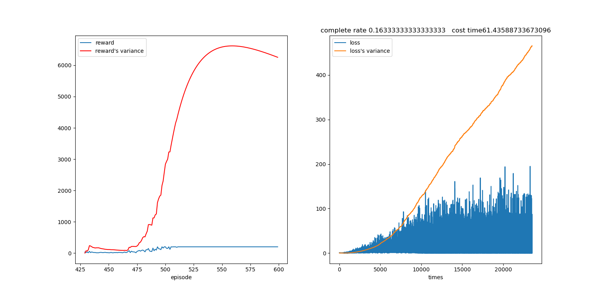

  - 可以看到reward在episode500左右开始剧增，这代表这时候才开始进行学习，在575左右方差到达峰值，准备下降，代表reward趋于稳定
  - loss值不断波动，但整体为递增态势，其方差也在飞速增长。

- #### 归总：改版后DQN在episode到达400~500之间才开始学习，这时reward才开始有数值，所以reward方差也在这阶段飙升，而方差到达极值是在500~700直接，此前的reward波动巨大。在方差到达极点后，随着方差逐渐减小，reward的波动也在逐渐减小，如果episode足够，将稳定在200 。缺点是耗时太久。loss波动巨大，且整体呈增加态势，直到reward稳定到一定程度时到达一个极值，之后与方差一起快速下降，并趋于稳定。

##### PG

- #### episode = 3000

  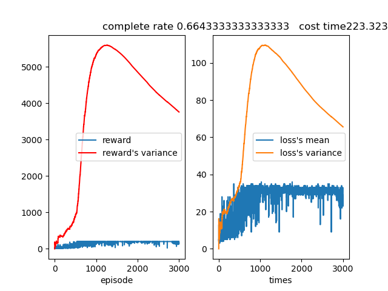

  - 可以看到方差在episode1300左右到达峰值开下降，而之后的reward和loss值都取于平稳，波动减小。

- #### episode = 2000

  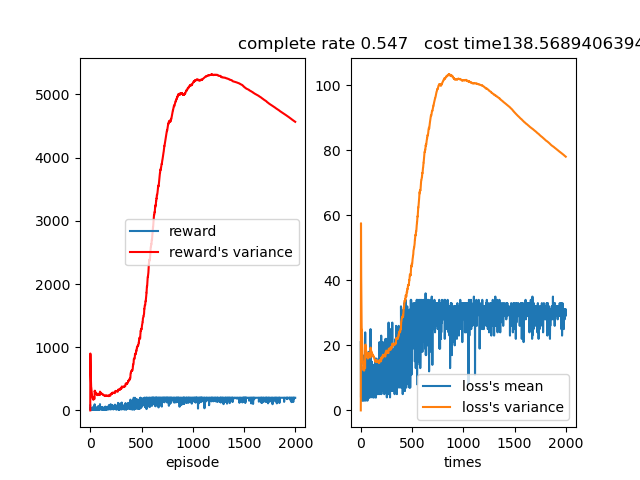

- #### episode = 1000

  

- #### 归总：因为PG从episode一开始就进行学习，所以reward开始就有值，而且波动巨大，而方差也是逐渐增加，但是在400~500左右回和DQN一样飙升，之后在1200左右reward方差到达极值，而之后的reward的波动也在逐渐减小。PG的loss因为和reward是同时更改，所以曲线态势和方差都类似：曲线开始波动巨大，方差也逐渐增加，在400~500飙升，方差到极值后，loss也逐渐平稳。

#### **分析总结和结论**

- 但经过三幅图像可以看出，改版前DQN的方差

- ##### 经过上述分析，以及各种调参及实验可以看出，在实验算法合理的情况下，reward方差终将逐渐趋向于平稳，即对应的学习网络逐渐近似最佳情况网络。

- DQN和PG的reward的方差变化几乎一致，都是在400~500左右飙升，之后到达极值后下降趋于平稳。


#### 本次实验使用DQN和PG策略，经过代码学习和结果分析，可以得到两者的差别：

1.DQN基于值的方法，简单说就是先学出个值函数  ,然后通过值函数确定策略。而PG基于策略的方法则是，直接通过一个目标函数去训练出一个策略

2.DQN的输入是state和action一起，输出对应的是action的确切值，PG的输入是state，输出对应的是env的ActionInfo

3.经由本次实验数据改版前DQN**可以不考虑**。**改版后DQN学习效率高，episode可以不用的特别大就开始收敛，可以取得很好的结果，但是耗时过长。PG耗时短，因为从第一次episode就开始学习，所以就算再样例很小，reward方差曲线才刚开始下降就可以取得高于DQN的游戏完成率，但是学习效率比DQN差，需要更多episode才能达到与DQN相似的结果。**

4.**DQN学习到完成率极高所需的episode少，但耗时长，且episode小时完成率不理想；PG学习到完成率极高所需的episode很多，但耗时短，且episode小时完成率比DQN高(该环境中因为DQN从400~500次episode才开始学习，而PG一开始就学)**

## 四.参考资料

[Deep Q-Network 学习笔记（二）—— Q-Learning与神经网络结合使用（有代码实现） - cjnmy36723 - 博客园 (cnblogs.com)](https://www.cnblogs.com/cjnmy36723/p/7018860.html)

《深度强化学习教程》王树森 黎彧君 张志华 著
